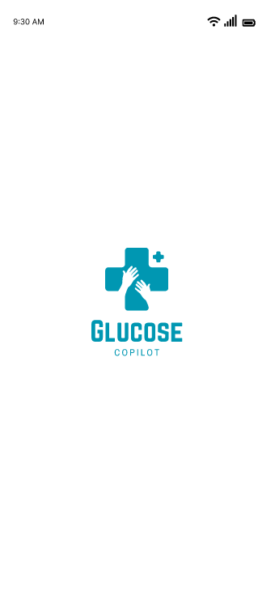
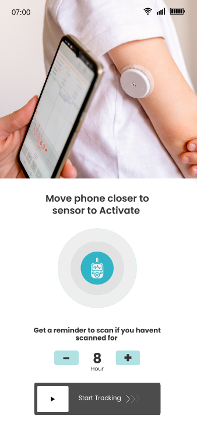
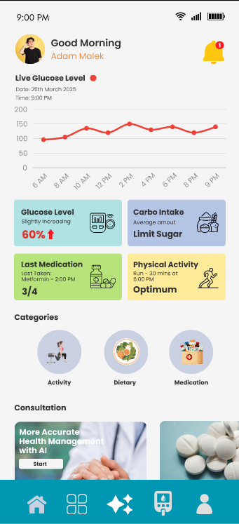
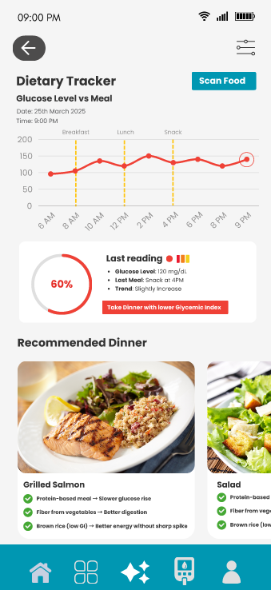
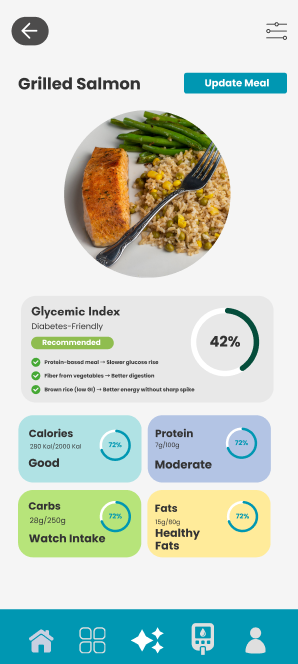
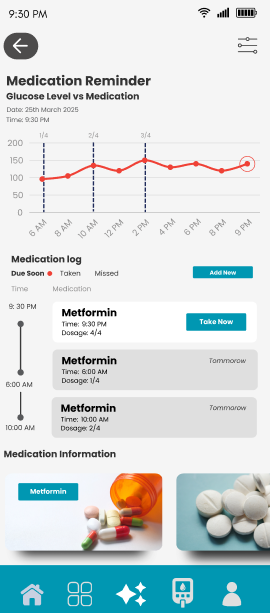
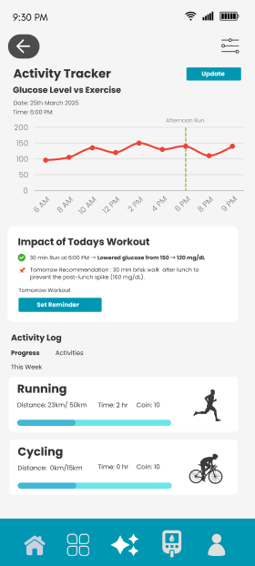
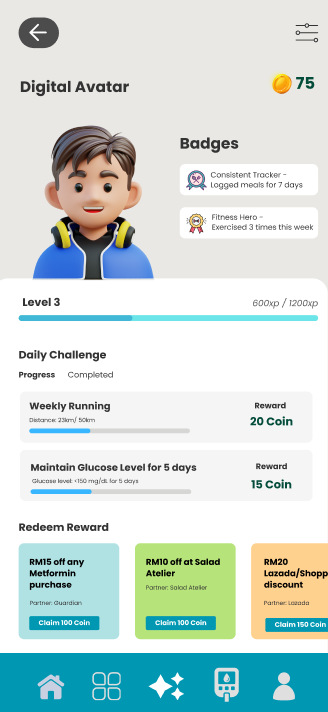

# Glucose Copilot
Introducing **Glucose CoPilot**! An AI-powered mobile app for diabetic patient support in Malaysia. Glucose CoPilot integrates three expert agents for an effective and holistic disease management approach. The core AI assistant provides real-time insights and personalized recommendations, ensuring users know exactly when and how to manage their diabetes effectively.

## Features
- 📊 **Monitor live glucose**
- 🍽️ **Personal AI-powered meal planning system**
- 📷 **AI vision system for detecting food's glycemic level**
- 🏋️ **AI-powered physical activity planner**
- 💊 **AI-powered medication tracker, reminder, and consultant**
- 🎮 **Gamification for user retention using reward redemption**

## Screenshots

<p align="center">
  
  
  
</p>
<p align="center">
  
  
  
</p>
<p align="center">
  
  
</p>

## Tech Stack
- **Client:** Flutter
- **Server:** Supabase, n8n, OpenAI API

## Installation
Install **Glucose Copilot** with Flutter:

```bash
git clone https://github.com/iforce428/Glucose_Copilot.git
cd Glucose_Copilot
flutter pub get
flutter run
```

## Dependencies
-   http: ^0.13.5
- fl_chart: ^0.70.2
- percent_indicator: ^4.2.3
- timeline_tile: ^2.0.0
- image_picker: ^1.1.2